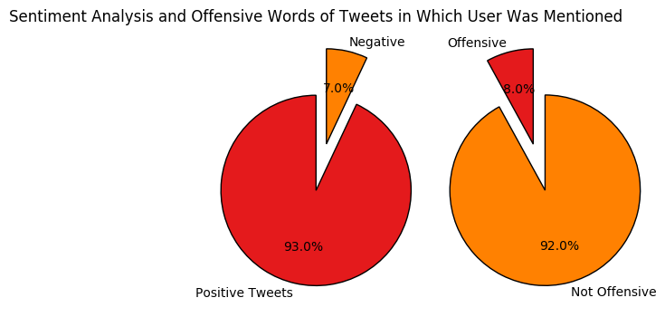

Smart Tweet System:
Here we develop an API which performs sentiment analysis and offensive word detection on User's news feed, User's mentions, tweets obtained using a search term, tweets of a specified user. We use twitter API as a means to extract the required tweets.
The code is self explanatory with comments.


```python
#import required libraries
import numpy as np
import matplotlib as plt
import pandas as pd
import twitter
import cPickle as pickle
import matplotlib.pyplot as plt
from matplotlib import cm
```


```python
class SmartTweet:
    def __init__(self):
        self.api = twitter.Api(consumer_key='hLLtvZWWdG3TAgmWoGkBJy50w',
                      consumer_secret='3KcQXtuJUsyNtbO6XelTNhTlJhh8rmTEA1IdL1Xulr4hxXQC8r',
                      access_token_key='153309853-n1GU77ujtU0Do1RW30fzMcLUzTkf3pJqhMJd4ePn',
                      access_token_secret='O2jBGJTkPZ30At4Ull2sXZeKThcb5hKmGtRVyF7TydP9x')
    #take tweets and return both tweets and predictions
    
    def sentimentAnalysis(self,tweets):
        #load the trained text classification model || input = tweets  and output = tweets + prediction(0 or 1)
        clf=pickle.load(open('SvmClassifier.p'))            
        return (tweets,list(clf.predict(np.array(tweets))))

    
    def listOffensiveTweets(self,tweets):
        df=pd.read_csv('bad_words.txt')
        bad_words=set(df.ix[:,0].values)
        tweets_=[set(tweet.split(' ')) for tweet in tweets]
        prediction=[]
        for tweet in tweets_:
            if len(tweet.intersection(bad_words))!=0:
                prediction.append(1)
            else:
                prediction.append(0)
        return (tweets,prediction)
    

    def sentimentAnalysisOfNewsFeed(self):
        statuses=self.api.GetHomeTimeline(count=200, since_id=None, max_id=None, 
                                          trim_user=False, exclude_replies=False, 
                            contributor_details=False, include_entities=True)
        tweets=[status.text for status in statuses]
        return self.sentimentAnalysis(tweets)
        
    #sentiment analyis of recent 200 specified user tweets
    def sentimentAnalysisOfUser(self,screen_name):
        statuses=self.api.GetUserTimeline(screen_name=screen_name,count=200)
        tweets=[status.text for status in statuses]
        return self.sentimentAnalysis(tweets)
        
        
    #sentiment analysis of the recent 200 mentioned tweets
    def sentimentAnalysisOfMentionedTweets(self):
        statuses=self.api.GetMentions(count=200)
        tweets=[status.text for status in statuses]
        return self.sentimentAnalysis(tweets)
    
    #sentiment analysis of the tweets which contain the search term
    def sentimentAnalysisOfSearchTweets(self,searchTerm):
        statuses=self.api.GetSearch(term=searchTerm,count=100)
        tweets=[status.text for status in statuses]
        return self.sentimentAnalysis(tweets)
    
    def offensiveTweetsOfNewsFeed(self):
        statuses=self.api.GetHomeTimeline(count=200)
        tweets=[status.text for status in statuses]
        return self.listOffensiveTweets(tweets)
    
    def offensiveTweetsOfUser(self,screen_name):
        statuses=self.api.GetUserTimeline(screen_name=screen_name,count=200)
        tweets=[status.text for status in statuses]
        return self.listOffensiveTweets(tweets)
        
    def offensiveTweetsOfMentionedTweets(self):
        statuses=self.api.GetMentions(count=200)
        tweets=[status.text for status in statuses]
        return self.listOffensiveTweets(tweets)
    
    def offensiveTweetsOfSearchTweets(self,searchTerm):
        statuses=self.api.GetSearch(term=searchTerm,count=100)
        tweets=[status.text for status in statuses]
        return self.listOffensiveTweets(tweets)
    
    def getTrends(self,exclude=None):
        topics=self.api.GetTrendsCurrent(exclude=exclude)
        return topics
        stats,tweets=[self.sentimentAnalysisOfSearchTweets(topic) for topic in topics]
    
    
    def plotPieChart(self,predictions,subplot,category0,category1,title):
        # Pie chart, where the slices will be ordered and plotted counter-clockwise:
        
        positives=predictions.count(1)
        negatives=predictions.count(0)
        
        labels = category1, category0
        sizes = [positives, negatives]
        explode = (0, 0.5)  # only "explode" the 2nd slice (i.e. 'Hogs')
        cs=cm.Set1(np.arange(2)/2.)
        plt.subplot(subplot)
        plt.pie(sizes, explode=explode, labels=labels, autopct='%1.1f%%',shadow=False, startangle=90,colors=cs)
        plt.axis('equal')  # Equal aspect ratio ensures that pie is drawn as a circle.
        plt.title(title)
```


```python
#initializing the smartTweet class
st=SmartTweet()
```


```python
#sentiment analysis and offence words of the user's news feed
sentiTweets,sentiPredictions=st.sentimentAnalysisOfNewsFeed()
offenceTweets,offencePredictions=st.offensiveTweetsOfNewsFeed()
```


```python
#plotting the analysis using pie charts
st.plotPieChart(sentiPredictions,121,'Negative','Positive Tweets','Sentiment Analysis and Offensive Words in News Feed of the User using the Smart Tweet System')
st.plotPieChart(offencePredictions,122,'Not Offensive Tweets','Offensive', ' ')
plt.show()
```


```python
#sentiment analysis and offence words of the specified user's feed
screen_name='@rihanna'
sentiTweets,sentiPredictions=st.sentimentAnalysisOfUser(screen_name)
offenceTweets,offencePredictions=st.offensiveTweetsOfUser(screen_name)
```


```python
#plotting the analysis using pie charts
st.plotPieChart(sentiPredictions,121,'Negative','Positive Tweets','Sentiment Analysis and Offensive Words of the User - '+screen_name.upper()+' Statuses')
st.plotPieChart(offencePredictions,122,'Not Offensive Tweets','Offensive', ' ')
plt.show()
```


```python
#sentiment analysis and offence words of the tweets obtained from a search term
search_term='isis'
sentiTweets,sentiPredictions=st.sentimentAnalysisOfSearchTweets(search_term)
offenceTweets,offencePredictions=st.offensiveTweetsOfSearchTweets(search_term)
```


```python
#plotting the analysis using pie charts
st.plotPieChart(sentiPredictions,121,'Negative','Positive Tweets','Sentiment Analysis and Offensive Words of Tweets from the Search Term - '+search_term.upper())
st.plotPieChart(offencePredictions,122,'Not Offensive','Offensive', ' ')
plt.show()
```


```python
#sentiment analysis and offence words of the tweets in which the user was mentioned
search_term='soccer'
sentiTweets,sentiPredictions=st.sentimentAnalysisOfSearchTweets(search_term)
offenceTweets,offencePredictions=st.offensiveTweetsOfSearchTweets(search_term)
```


```python
#plotting the analysis using pie charts
st.plotPieChart(sentiPredictions,121,'Negative','Positive Tweets','Sentiment Analysis and Offensive Words of Tweets in Which User Was Mentioned' )
st.plotPieChart(offencePredictions,122,'Not Offensive','Offensive', ' ')
plt.show()
```




